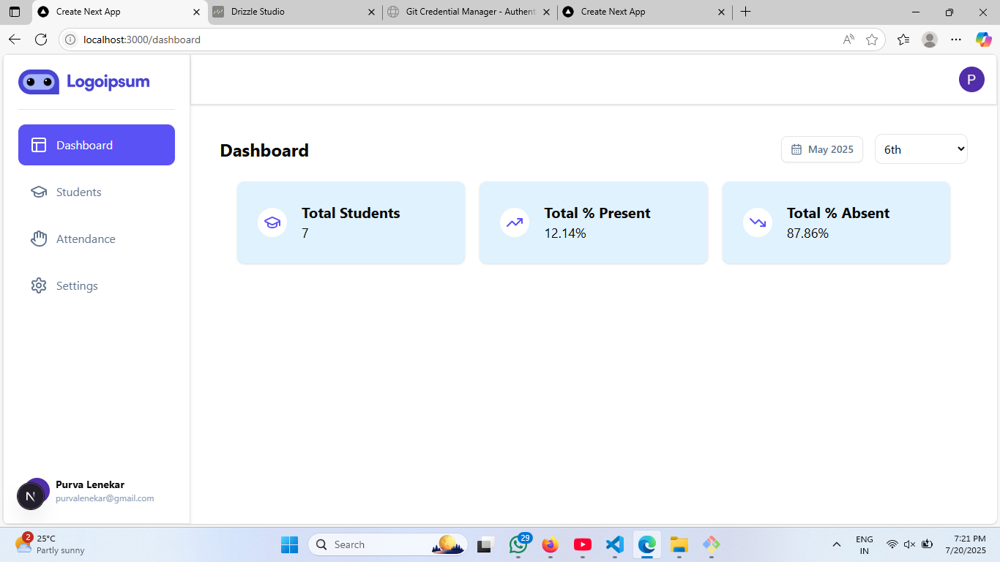
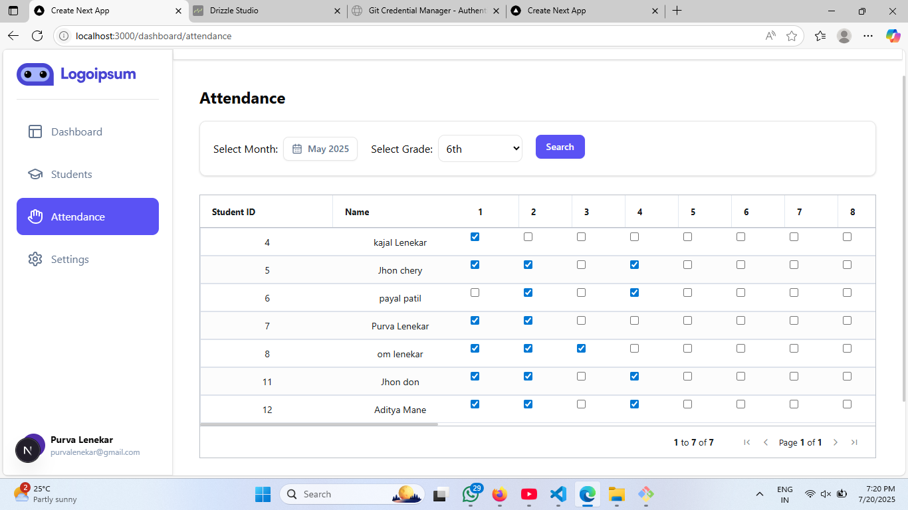
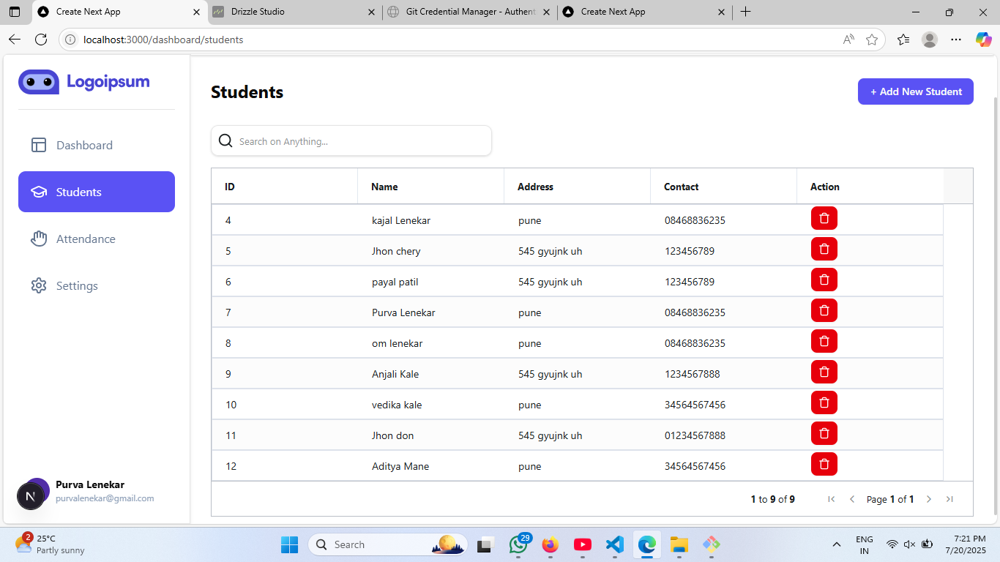

# 🎓 Student Attendance Dashboard

A full-stack student attendance management system built with **Next.js**, **Tailwind CSS**, and **Node.js**.

---

## 🚀 Features

- 🔐 **User Authentication**
- 🌗 **Dark Mode Toggle**
- 🧭 **Responsive Side Navigation and Header**
- 🧑‍🎓 **Add / View / Delete Student Records**
- 🗓️ **Attendance Management Screen**
- 📊 **Dashboard with Cards (Total Students, Present, Absent)**

---


> ## 📸 Screenshots

### 📊 Dashboard Page


---

### 📝 Attendance Page


---

### 👥 Students Page



---

## 🛠️ Tech Stack

- **Frontend**: React (Next.js), Tailwind CSS
- **Backend**: Node.js, Express.js
- **Database**: MongoDB

---

## 📦 Installation

```bash
# Clone the repo
git clone https://github.com/your-username/student-attendance-dashboard.git
cd student-attendance-dashboard

# Install dependencies
npm install

# Run the development server
npm run dev
